# HappyHouse🏡

> 첫번째 웹 프로젝트, SSAFY(삼성 청년 소프트웨어 아카데미) 1학기 마지막 프로젝트, 우수 프로젝트 수상작

<u>아파트 거래 정보</u> 제공 사이트를 주제로 한 프로젝트입니다. 자녀 교육을 염두해두고 아파트를 고르는 부모들이 참고할만한 <u>학군이나 주변 환경 정보</u>들을 함께 보여주도록 하였으며, 인증된 사용자만 사용할 수 있는 <u>동네별 커뮤니티 서비스</u>를 제공하여 사이트 이용자간의 교류가 발생하는 것을 목표로 만들었습니다. [**시연 영상**](https://youtu.be/zkH_b0ycTug)

## Team

- 김유진
- 박성일

## 기술 및 구조도

##### Front-End

- Vue.js
- Bootstrap Vue

##### Back-End

- Spring Boot
- MySQL

## ERD

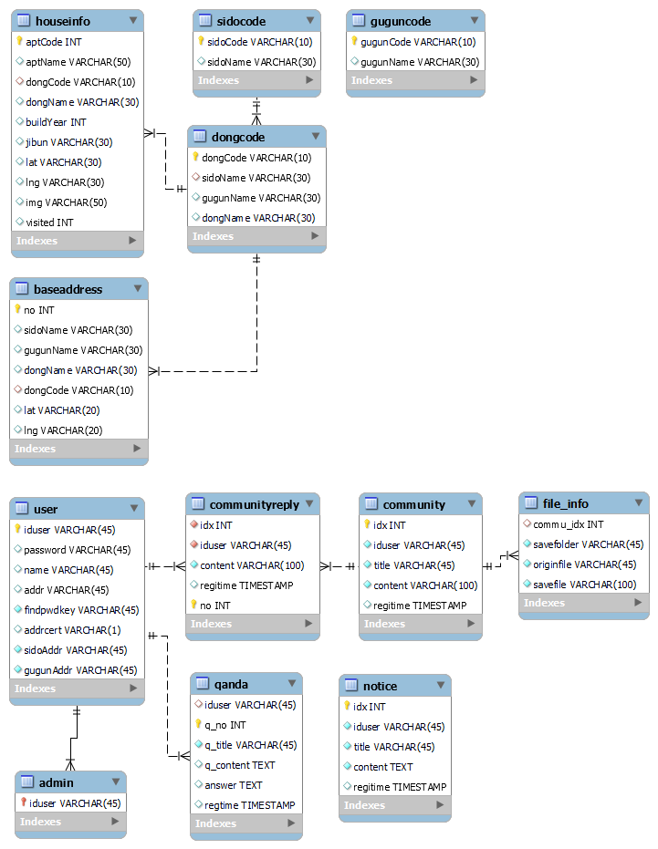

## 핵심 기능

- 아파트 거래 정보
  - 지도의 움직임에 따라 아파트 마커와 목록 표시
  - 지도 상의 마커나 목록 클릭 시 아파트 거래 정보와 주변 환경 정보 표시
  - 거래 정보는 공공 데이터에서, 주변 환경 정보는 카카오맵 API에서 불러옴
  - 카테고리 클릭 시 카테고리별 마커 표시, 마커 클릭 시 상세 페이지로 이동
  - 법정동 선택 시 지도 이동하도록 구현 
- 아파트 관련 정보
  - 조회수가 높은 10개의 매물을 차트(Chart.js 이용)와 함께 표시
  - 네이버 검색 API에서 아파트 관련 기사들을 가져와 표시

- 사용자 관리
  - JWT(JSON Web Token) 이용
  - 회원가입 및 로그인, 로그아웃
  - 회원 정보 조회 및 수정
  - 비밀번호 찾기

- 공지사항
  - 관리자만 작성 가능
  - 공지사항 등록, 수정, 삭제

- 커뮤니티
  - 동별 커뮤니티 게시판
  - 게시글 등록, 수정, 삭제
  - 댓글 등록, 수정, 삭제
- QnA 게시판
  - 로그인한 사용자만 작성 가능, 관리자만 답글 작성 및 수정 가능

## 주요 화면

##### 메인 페이지

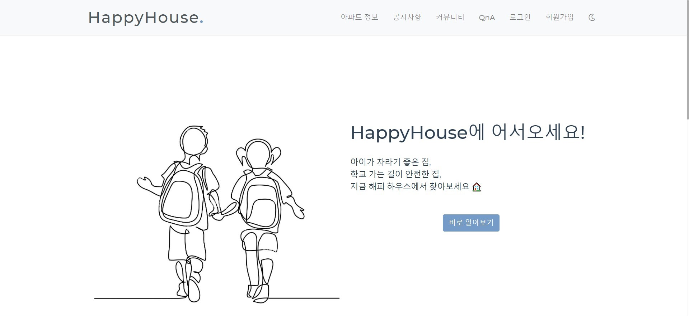

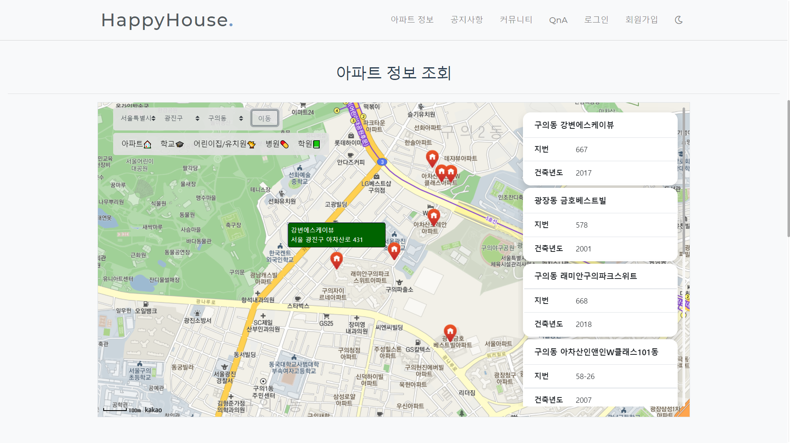

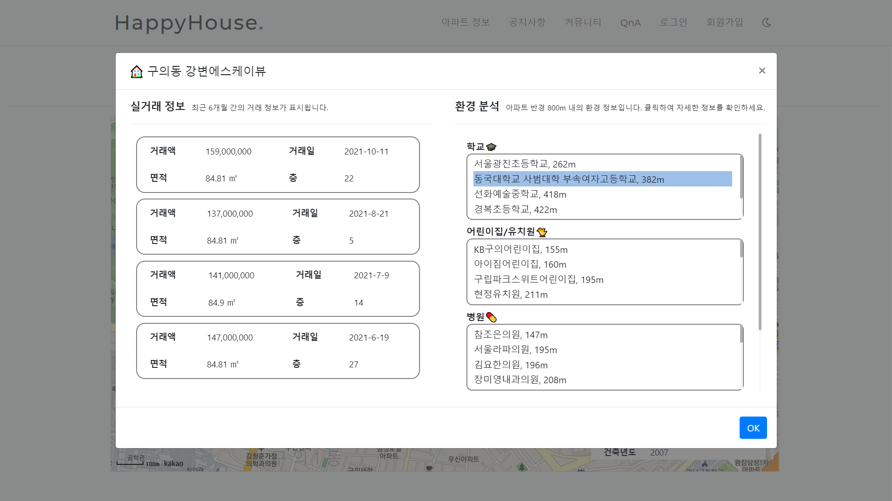

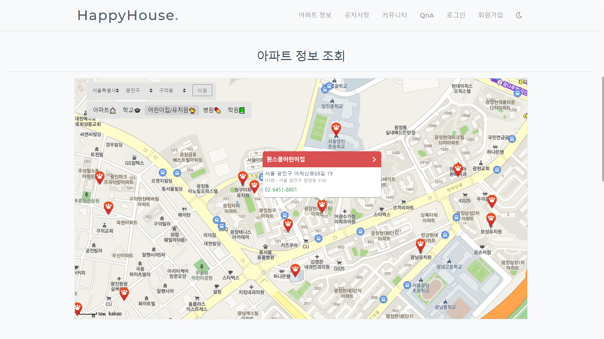

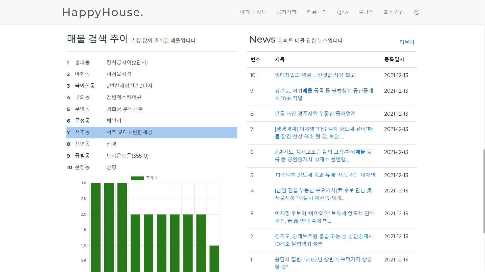

---

##### 공지사항

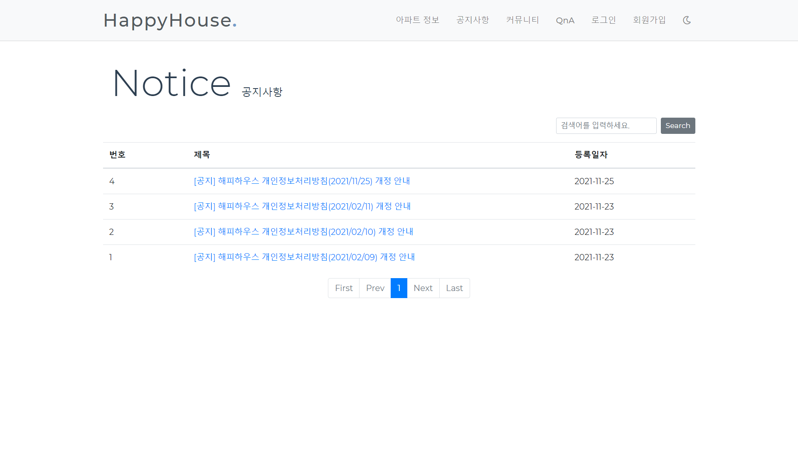

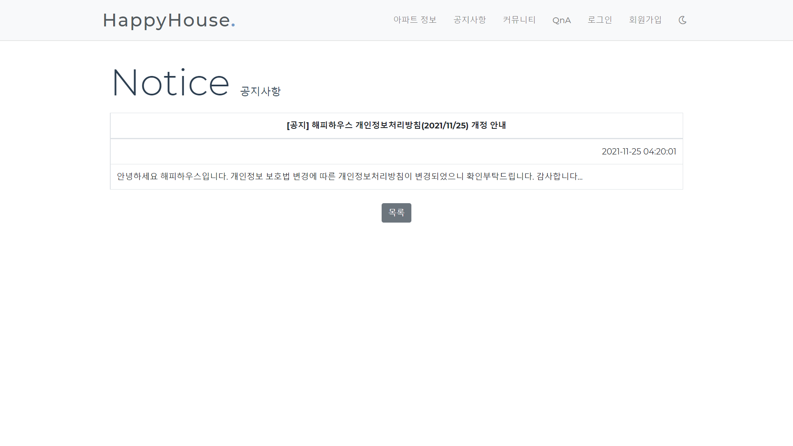

---

##### 커뮤니티

**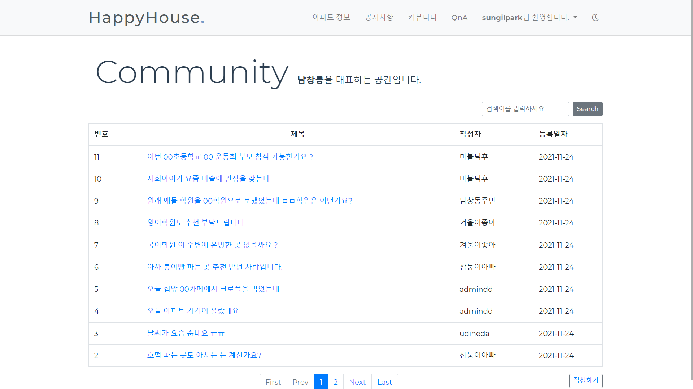

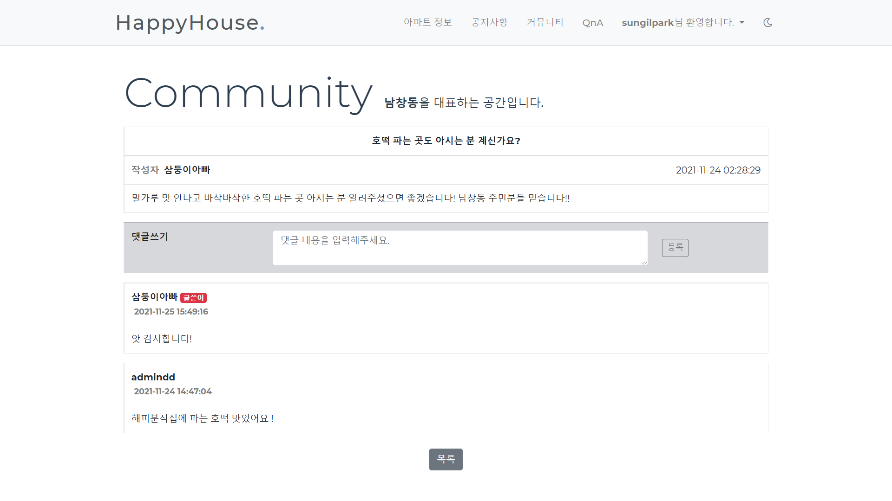

---

##### QnA

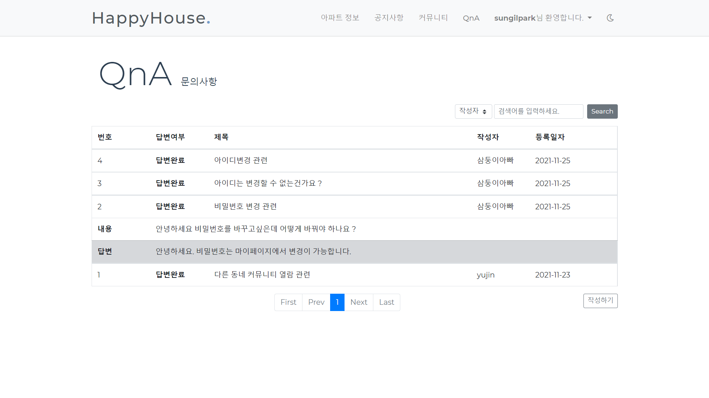

---

##### 로그인/회원가입, 회원정보, 비밀번호 찾기

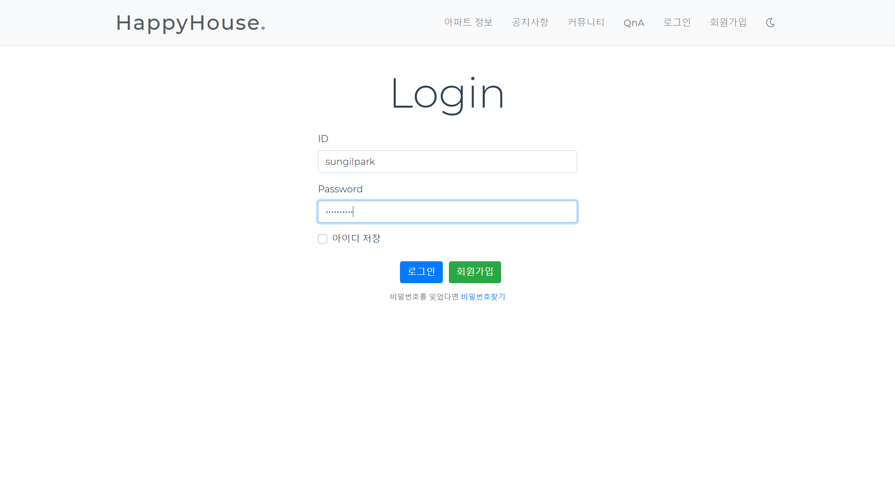

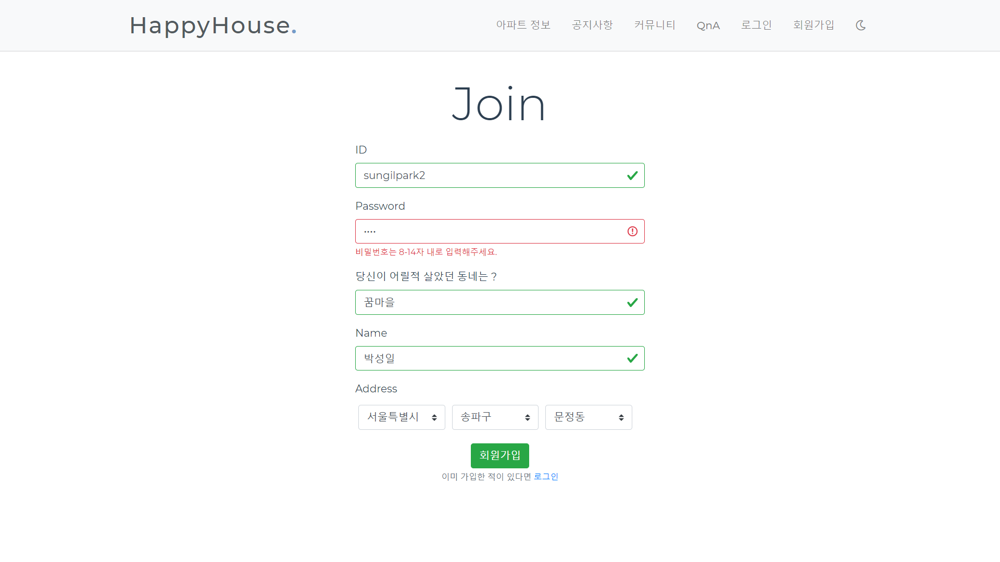

